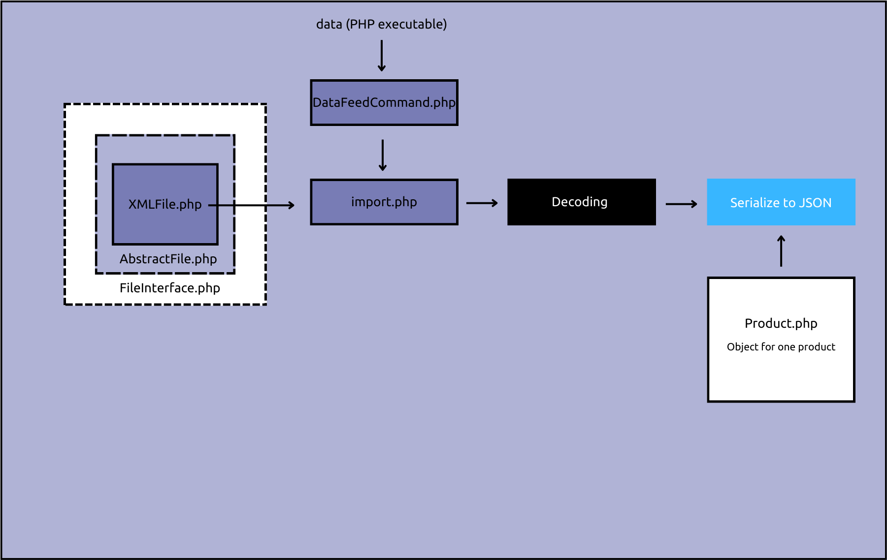
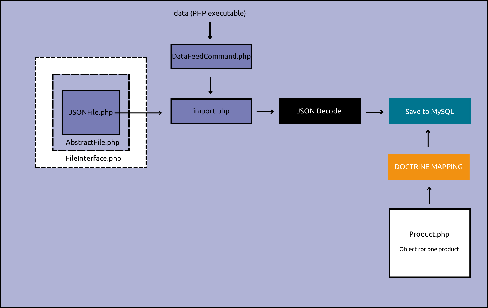

<h1>Data Feed</h1>
<p>A command line tool to parse a local XML file (feed.xml) to a MySQL database or a JSON file.</p>

<h2>Project Overview: From XML to MySQL</h2> 


<h2>Setting up the project</h2>
<p>Inside DataFeed:</p>

```bash
composer install
```

<p>Inside mysql command line:</p>

```bash
CREATE DATABASE IF NOT EXISTS data_feed;
```

```bash
USE data_feed;
```

```bash
CREATE TABLE IF NOT EXISTS products (
        id INT NOT NULL AUTO_INCREMENT PRIMARY KEY,
        entity_id INT,
        category_name VARCHAR(255),
        sku VARCHAR(255),
        name VARCHAR(255),
        description TEXT,
        shortdesc TEXT,
        price VARCHAR(255),
        link VARCHAR(255),
        image VARCHAR(255),
        brand VARCHAR(255),
        rating VARCHAR(255),
        caffeine_type VARCHAR(255),
        count VARCHAR(255),
        flavored VARCHAR(255),
        seasonal VARCHAR(255),
        instock VARCHAR(255),
        facebook INT,
        is_k_cup INT,
        file_name VARCHAR(255)
);
```


<h2>Usage</h2>
from XML to MySQL

```bash
php ./data dataFeed -f "feed.xml" -p "database"
```

from XML to JSON
```bash
php ./data dataFeed -f "feed.xml" -p "json"
```

from JSON to MySQL
```bash
 php ./data dataFeed -f "test.json" -p "database"
```

<h2>Extensibility</h2>
Because of the abstraction and the object Product, you can add your own type of input and output storage.
<h3>From XML to JSON</h3>

<ul>Steps to export into JSON</ul>
<li>Create a directory for the JSON files within the directory outputFiles
<code>mkdir outputFiles/JSON</code></li>
<li>Add 'json' to protected static array $pushToTypes in the file src/app/file/OptionsValidation.php
    in order to pass the validation of the command. 
</li>
<li>Update FileInterface.php and add <code>public function pushToJSON(array $data); </code></li>
<li>Update AbstractFile.php with the new final function pushToJSON</li>

```bash
final public function pushToJSON($data)
    {
        try {
            $encoders = [new XmlEncoder(), new JsonEncoder()];
            $normalizers = [new ObjectNormalizer()];
            $serializer = new Serializer($normalizers, $encoders);

            $allProducts = $this->productBuild($data, 'json');

            $jsonContent  = $serializer->serialize($allProducts, 'json', ['json_encode_options' => \JSON_PRESERVE_ZERO_FRACTION]);
            $jsonContent = trim($jsonContent, '[]');

            $jsonFileName = $this->getFileName() . '_' . date('Y-m-d_H-i-s');
            $jsonFilePath = dirname(__DIR__, 3) . '/outputFiles/JSON/'  . $jsonFileName . '.json';

            file_put_contents($jsonFilePath, $jsonContent);
        } catch (Exception | TypeError $e) {
            $logDirectory = dirname(__DIR__, 3) . '/outputFiles/errorLogs';
            $logFile = new ErrorLog($logDirectory);
            $logFile->writeLog('Error: ' . $e->getMessage());

            exit('Error: ' . $e->getMessage());
        }
    }
```
<li>Update the function pushData($data, $storageType) XMLFile.php with the new final function pushToJSON</li>

```bash
public function pushData($data, $storageType)
    {
        if ($storageType == "database") {
            $this->pushToMySQL($data);
        } elseif ($storageType == "json") {
            $this->pushToJSON($data);
        } else {
            throw new \Exception('Failed to push data into ' . $storageType  . ' storage');
        }
    }
```

<h3>From JSON to MySQL</h3>

<li>Add 'json' within the protected static array $extensions in src/app/file/OptionsValidation.php </li>
<li>Create a new directory titled "json" in src/app/file/ .</li>
<li>Create import.php and a class JSONFile. Use as a reference the same files under the src/app/file/xml like the following:</li>

```bash
class JSONFILE extends AbstractFile
{
    public function decoding($fileName)
    {
        $this->setFileName($fileName);
        $this->setFilePath($fileName);

        $jsonContent = file_get_contents($this->getFilePath());

        return json_decode($jsonContent, true);
    }

    public function pushData($data, $storageType)
    {
        if ($storageType == "database") {
            $this->pushToMySQL($data);
        } else {
            throw new \Exception('Failed to push data into ' . $storageType  . ' storage');
        }
    }
}
```

<h3>Logging Errors</h3>
<p>The errors are logged into outputFiles/errorLogs through the ErrorLog.php class</p>

<h3>Testing</h3>
<p>At first stages of the project I've run import.php for quick fixes</p>

```bash
php src/app/file/xml/import.php --file="test.xml" --pushTo="database"
```

<p>Afterward I've written PHPUnit tests (tests/unit)</p>